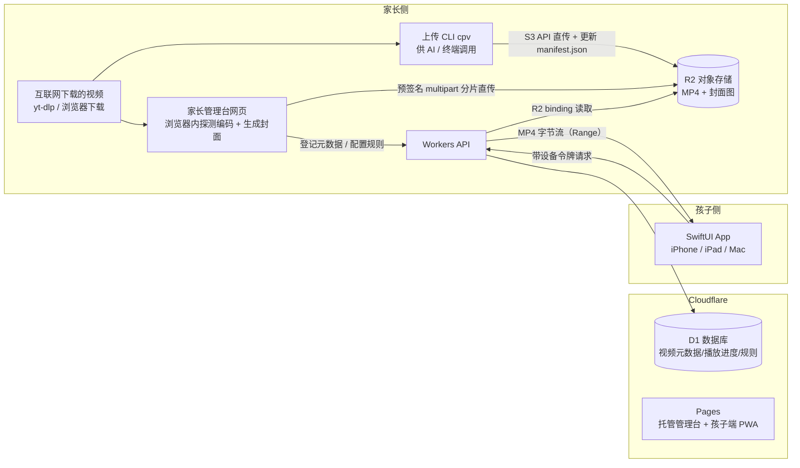

# 儿童流媒体视频播放器 — 架构设计

> 版本：v0.6（2026-06-13）。v0.2：入库**默认不转码**；播放从 HLS 简化为 MP4 渐进式。v0.3：新增后台网页直传。v0.4：上传 CLI `cpv` 落地为一等公民（供 AI 调用，已实现于 `cli/`），播放列表单一事实源改为 R2 中的 `manifest.json`。v0.5：孩子端定为**原生 SwiftUI 多平台 App（iPhone / iPad / Mac）**，移除 PWA 方案。v0.6：分发改为 **SideStore 免费侧载**（不交 $99/年）。
> 目标：家长定期上传视频，孩子在一个**封闭内容花园**里观看——没有推荐流、没有外部内容入口、没有广告，孩子只能看到家长放进去的东西。

---

## 1. 设计原则

1. **封闭花园**：孩子端不存在任何"打开外部世界"的入口（无搜索外网、无 WebView 浏览、无推荐算法）。内容只来自家长上传。
2. **格式收敛在入库侧，而不是播放侧**：三个参考项目（QPlayer 等）之所以要堆 ijkplayer/FFmpeg 多内核兜底，是因为它们要接受任意格式。我们反过来——入库时统一收敛为 H.264/AAC 的 MP4。互联网来源的视频绝大多数本来就是这个格式，所以"收敛"通常只是秒级的重封装而**不是转码**（见 §4.2）。播放端全是 Apple 平台（iPhone/iPad/Mac），统一用系统 **AVPlayer**，不需要任何第三方解码内核。
3. **成本随字节走，不随时长走**：用对象存储（按 GB 计费）+ 免费出口流量，避开按"视频分钟数"计费的托管方案（见 §6 成本分析）。
4. **家庭量级，不过度设计**：观众 1–3 人，不需要鉴权服务集群、不需要多区域、不需要 ABR 多码率（先单码率，需要再加）。

---

## 2. 来自三个参考项目的取舍

| 项目 | 定位 | 借鉴 | 忽略 |
|---|---|---|---|
| [QPlayer](https://github.com/itenfay/QPlayer) (iOS) | 完整的本地视频播放 App，WiFi 上传 + 多内核 | ① 播放内核独立成"管理层"，业务层不绑定具体播放器；② MVP 分层工程结构；③ WiFi 局域网上传的轻量思路（我们的 MVP 阶段可用类似思路做局域网直传） | ① Web 在线视频解析功能——这是**儿童安全红线**，孩子端绝不能有；② KSYMediaPlayer 商业 SDK；③ ijkplayer 软解兜底（我们格式统一后不需要） |
| [Collected-VideoViewPlayer](https://github.com/sendtion/Collected-VideoViewPlayer) | 播放器项目链接清单（无代码，已停更） | 其中 ArtPlayer 体现的"播放内核可插拔抽象"思路 | 仓库本身只是导航页 |
| [EasyPlayer](https://github.com/tsingsee/EasyPlayer) | 安防监控低延迟 RTSP/RTMP SDK（主仓库 2017 年后停更） | 流/文件加密保护私有内容的思路 | 整个 RTSP/RTMP 低延迟直播栈——我们是点播（VOD），协议栈完全用不上 |

三个项目都缺、需要我们自建的：**家长控制（PIN、时长限制）**、**儿童友好 UI**、**云端内容库**。

---

## 3. 总体架构



**一个 Cloudflare 账号跑通云端全部**：Pages（家长管理台，免费）+ Workers（API + 媒体网关，免费额度内）+ D1（进度/规则，免费额度内）+ R2（视频存储，唯一的实际云端开销）。孩子端是原生 App，不依赖 Pages。

---

## 4. 分层设计

### 4.1 存储层（R2）

Bucket 保持**私有**，目录布局：

```
manifest.json                         # 播放列表（视频库的单一事实源）：CLI/管理台写，播放器读
videos/{video_id}/video.mp4           # H.264/AAC + faststart，单文件渐进式播放
videos/{video_id}/poster.jpg          # 封面图
```

- 互联网来源的 720p 视频通常 1–2.5 Mbps，1 小时 ≈ 0.5–1.1 GB，直接入库即可。
- **选 MP4 渐进式而非 HLS**：家庭场景没有弱网 ABR 需求，单文件配合 HTTP Range 请求即可流畅起播和拖动进度，还省去切片产生的海量小请求、离线下载也不用拼装。未来真需要 HLS 时，用 `ffmpeg -c copy` 几秒就能从 MP4 重新打包，不锁死。

### 4.2 入库流水线 —— 后台网页上传，默认不转码

**主路径完全在管理台网页里完成**，家长不需要在电脑上装任何工具：

1. 打开管理台（家长鉴权后），把下载好的视频拖进上传框；
2. 页面在浏览器内解析文件头（mp4box.js）探测编码：H.264/AAC 的 MP4（互联网视频的绝大多数）直接进入下一步；不兼容的文件当场提示，走下方转码兜底；
3. 浏览器经 **R2 预签名 multipart URL 分片直传**。视频字节**不能**经 Worker 转发——Workers 请求体上限 100 MB，直传 R2 是必须的设计，顺带不占任何 Worker 配额；
4. 封面图和时长在浏览器内生成（`<video>` seek 到第 10 秒 + canvas 截图），无需服务端处理；
5. 上传完成后页面调 Workers API 登记元数据（标题/系列/时长/封面）。

整条链路没有服务端转码环节——Workers 跑不了 ffmpeg，而我们也不需要它跑。网页直传不做 faststart 重封装是可接受的取舍：互联网下载的 MP4 基本都已带 faststart，即使没有，播放器也会自动用 Range 请求去文件尾读索引，只是首帧稍慢。

**转码兜底（仅限管理台提示不兼容的少数文件）**：在本地跑一条 ffmpeg 命令后再上传。三种情况只有最后一种真正转码：

| 情况 | 处理 | 耗时/质量 |
|---|---|---|
| A. H.264/AAC + MP4（最常见） | 仅 `-c copy -movflags +faststart` 重封装，把索引挪到文件头利于流式起播 | 秒级，零质量损失 |
| B. H.264/AAC 但容器是 MKV/FLV 等 | `-c copy` 换容器为 MP4 | 秒级，零质量损失 |
| C. VP9/AV1/HEVC 等编码（少数） | 转码为 H.264/AAC | 慢，仅此情况烧 CPU |

```bash
# 探测编码
ffprobe -v quiet -print_format json -show_streams input.mkv

# 情况 A/B：重封装，不转码
ffmpeg -i input.mkv -c copy -movflags +faststart video.mp4

# 情况 C：兜底转码
ffmpeg -i input.webm -c:v libx264 -preset slow -crf 23 -c:a aac -b:a 96k \
  -movflags +faststart video.mp4

# 封面图
ffmpeg -i video.mp4 -ss 00:00:10 -frames:v 1 -vf "scale=480:-2" poster.jpg
```

**用 yt-dlp 下载时可以在源头直接消灭情况 C**——强制选 H.264/AAC 的 MP4 流，下载下来即是终态（`height<=720` 同时也是控制存储成本的开关）：

```bash
yt-dlp -f "bv*[vcodec^=avc1][height<=720]+ba[acodec^=mp4a]/b[ext=mp4]" \
  --remux-video mp4 <URL>
```

**CLI 上传（与网页并列的一等路径，已实现，见 `cli/`）**：

```bash
cpv upload <视频文件> --title "标题" [--series "系列名"] --json
```

流程：ffprobe 探测 → 按需重封装/转码兜底（同上表三条路）→ 生成封面/时长 → S3 API 直传 R2 → 读改写 `manifest.json`。**专为 AI 调用设计**：非交互、`--json` 结构化输出、明确退出码（0 成功 / 1 失败 / 2 缺配置 / 3 缺 ffmpeg）、`--id` 幂等覆盖、`--dry-run` 预览处理计划。上传完成后，播放器下一次拉取播放列表即可看到新视频。

### 4.3 API 层（Workers + D1）

视频库元数据的**单一事实源是 R2 里的 `manifest.json`**——CLI 和管理台都写它（整文件读-改-写，家庭规模没有并发问题），`/api/library` 直接读它返回，所以 CLI 上传后无需任何"同步"动作。D1 只存设备态数据：

```sql
CREATE TABLE watch_progress (
  video_id TEXT, device_id TEXT, position_sec INTEGER, updated_at INTEGER,
  PRIMARY KEY (video_id, device_id)
);
CREATE TABLE rules (             -- 家长控制规则
  device_id TEXT PRIMARY KEY,
  daily_limit_min INTEGER,       -- 每日观看上限
  allowed_hours TEXT             -- 允许时段，如 "16:00-19:30"
);
```

API 路由（单个 Worker）：

| 路由 | 鉴权 | 说明 |
|---|---|---|
| `GET /api/library` | 孩子设备令牌 | 读 `manifest.json` 返回播放列表（CLI 上传后，播放器下次拉取即见新视频） |
| `GET /media/{video_id}/*` | 孩子设备令牌 | **媒体网关**：校验令牌后用 R2 binding 流式返回视频字节，透传 `Range` 头以支持拖动进度 |
| `POST /api/progress` | 孩子设备令牌 | 上报播放进度（断点续播） |
| `POST /api/uploads` | 家长 | 签发 R2 预签名 multipart 上传 URL，供管理台浏览器分片直传 |
| `POST /api/videos` 等管理接口 | 家长（Cloudflare Access 或密码） | 登记/增删改视频元数据、配规则 |

**鉴权模型（家庭够用版）**：孩子设备首次由家长用 PIN 激活，下发一个长期设备令牌存在本地；所有媒体请求带令牌，Worker 校验后才从 R2 读字节。R2 永不公开直连。请求账：MP4 单文件 + Range 分段拉取，孩子端每月不过几千次请求，远低于 Workers 免费额度（10 万次/**天**）和 R2 Class B 免费额度（1000 万次/月）。

**部署域名**：Worker 绑定自有域名 `video.example.com`（该域名已托管在用户 Cloudflare 账号，Active）。不要用默认的 `*.workers.dev`——它在国内无法直连。

### 4.4 播放端（孩子用）—— 原生 iOS App + Mac App

**一套 SwiftUI 多平台代码，覆盖三种设备**：iPhone / iPad / Mac 共用一个 Xcode 多平台 target，播放统一用系统 AVPlayer（AVKit `VideoPlayer`）。H.264 MP4 + Range 渐进式播放是 AVPlayer 的原生能力，零第三方依赖——这是对 QPlayer"内核管理层"思路的极简继承：格式已在入库侧收敛，连内核抽象层都省了。

| 设备 | 形态 | 说明 |
|---|---|---|
| iPhone / iPad | iOS/iPadOS App（SwiftUI） | AVPlayer 播放；配合系统"引导式访问"把孩子锁在 App 内 |
| Mac | macOS App（同一代码库） | 全屏播放；设置入口藏在家长 PIN 后 |
| （未来）Apple TV | tvOS App（同代码库延伸） | 大屏场景，Phase 3 按需 |

媒体请求鉴权：AVURLAsset 用 `AVURLAssetHTTPHeaderFieldsKey` 自定义 HTTP 头携带设备令牌，封面图用 URLSession 带同一令牌加载；令牌在家长首次激活设备时写入 Keychain。

**分发方式：SideStore 免费侧载（已定，$0/年）**：

- **iPhone / iPad**：免费 Apple ID 签名（7 天证书 + 最多 3 个 App，我们只有 1 个），用 **SideStore** 在设备上自动续签——初次配置需要电脑配对一次，之后续签全在设备本地完成，日常无感。备选 AltStore：家里 Mac 常开时，同一 WiFi 下由 AltServer 自动续签，效果相同。
- **Mac**：本地构建直接运行（ad-hoc 签名），无过期问题，永远免费。
- **开发期**：Xcode 直接装到自己设备调试，不受影响。
- **已知风险**：iOS 大版本更新偶尔会暂时弄坏侧载工具的续签机制，需等工具更新。兜底方案：Worker API 与客户端无关，真出问题随时可以临时上一个 PWA 网页版顶着（Safari 添加到主屏幕），云端零改动。

**儿童 UI 要点**：
- 首页 = 大封面网格，按"系列"分组，无文字搜索（学龄前不识字）
- 防误触：退出/设置入口藏在长按 + 家长 PIN 后面
- 断点续播；播完自动播本系列下一集（仅限同系列，不跨系列"推荐"）
- 时长控制：达到 `daily_limit_min` 或超出 `allowed_hours` 时锁定播放，弹出友好的"休息一下"页面

---

## 5. 为什么是 Cloudflare（直接回答"适合吗"）

**适合，而且是这个场景的最优解之一**，但要用对产品——**用 R2，不要用 Cloudflare Stream**：

1. **合规明确**：Cloudflare 已修订旧 ToS 2.8 节，现行条款明确允许从 R2/Stream/Images 服务视频内容（限制只针对"托管在 Cloudflare 之外的视频源"）。从 R2 出视频点播（MP4 渐进式或 HLS 均可）完全合规。（来源：[官方公告](https://blog.cloudflare.com/updated-tos/)、[现行专属条款](https://www.cloudflare.com/service-specific-terms-application-services/)）
2. **出口流量永久免费**：孩子多看几集账单不会动，这是对家庭场景最大的心理减负。
3. **全家桶免费额度**：Pages/Workers/D1 的免费额度对家庭量级是数量级冗余。
4. **起步免费**：R2 免费档 10 GB ≈ 14 小时 720p 内容，验证期一分钱不花。

---

## 6. 成本分析（2026-06-11 官方价格，已核实）

按 500 GB 库、200 GB/月流量估算：

| 方案 | 月成本 | 评价 |
|---|---|---|
| **Cloudflare R2 + Workers + Pages** ✅ 推荐 | **≈ $7.4** | 出口免费、一个账号全打通、ToS 合规、起步免费 |
| Backblaze B2 + Cloudflare CDN | ≈ $3.5 | 名义最低（存储 $6.95/TB + Bandwidth Alliance 免流量），但要自己搭 B2→CDN 桥接，多一家厂商 |
| Bunny Stream | ≈ $6.0 | 自带转码/ABR/播放器，最不用动手；流量按 GB 计费（$0.005/GB 起） |
| **Cloudflare Stream** ❌ 不要用 | **≈ $175+** | 按分钟计费（$5/1000 分钟存储）。500 GB ≈ 3.5 万分钟 → 仅存储就 ~$175/月。它适合"库小、播放量大"，我们恰好相反 |

**结论**：库的规模是成本主导项（观众只有 1–3 人，分发几乎不要钱），所以一切按"视频时长"计费的方案都会被大库拖垮，按"字节"计费 + 免出口的 R2 是甜点位。如果未来库超过 2 TB 且想极限省钱，再迁移到 B2 + Cloudflare（S3 兼容 API，迁移成本低）。

> 互联网来源的视频通常已被源站压缩到合理码率（720p ≈ 1–2.5 Mbps），直接入库成本已经很低；下载时限制 720p（如 yt-dlp 的 `height<=720`）就是最有效的省钱开关。只有源是高码率原片时才值得转码压缩。

---

## 7. 实施路线

**Phase 1 — MVP（1–2 周）**
- [x] 上传 CLI `cpv`（`cli/`：探测/重封装/转码兜底 + 封面生成 + R2 直传 + 维护 manifest.json，`--json` 供 AI 调用）
- [ ] 创建 R2 bucket + API 令牌（步骤见 `cli/README.md`）
- [ ] Workers（library / media / progress 三组接口，library 直接读 manifest.json）
- [ ] SwiftUI 多平台 App（iPhone/iPad/Mac）：封面网格 + AVPlayer 播放 + 断点续播
- [ ] 设备令牌激活 + 家长 PIN
- [ ] SideStore 侧载到家庭 iPhone/iPad（免费 Apple ID + 自动续签）；Mac 端本地构建直装

**Phase 2 — 管理台与家长控制（+1–2 周）**
- [ ] 管理台网页：拖拽上传（预签名分片直传 + 浏览器内探测/封面生成）、排序、删除、系列管理
- [ ] 每日时长限制 + 允许时段 + "休息一下"锁定页

**Phase 3 — 体验增强（按需）**
- [ ] tvOS App（Apple TV 大屏，同一 SwiftUI 代码库延伸）
- [ ] 离线下载（出门用，URLSession 下载到本地 + AVPlayer 播本地文件）
- [ ] HLS + 多码率 ABR（仅当出现弱网/外网观看场景，从 MP4 `-c copy` 重新打包即可）
- [ ] 音频内容支持（播客/故事——同一套架构复用，单个 m4a 文件即可）

---

## 附：价格与条款来源（2026-06-11 获取）

- R2 定价：https://developers.cloudflare.com/r2/pricing/ （$0.015/GB/月，egress $0，免费档 10GB）
- Stream 定价：https://developers.cloudflare.com/stream/pricing/ （$5/千分钟存储，$1/千分钟分发）
- Workers/Pages 免费额度：https://developers.cloudflare.com/workers/platform/pricing/
- B2 定价与 Bandwidth Alliance：https://www.backblaze.com/cloud-storage/pricing
- Bunny 定价：https://bunny.net/pricing/ 、https://bunny.net/stream/
- R2 服务视频的 ToS 依据：https://blog.cloudflare.com/updated-tos/
